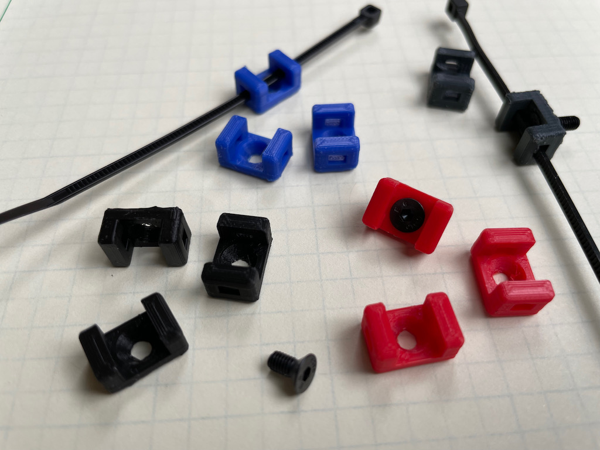
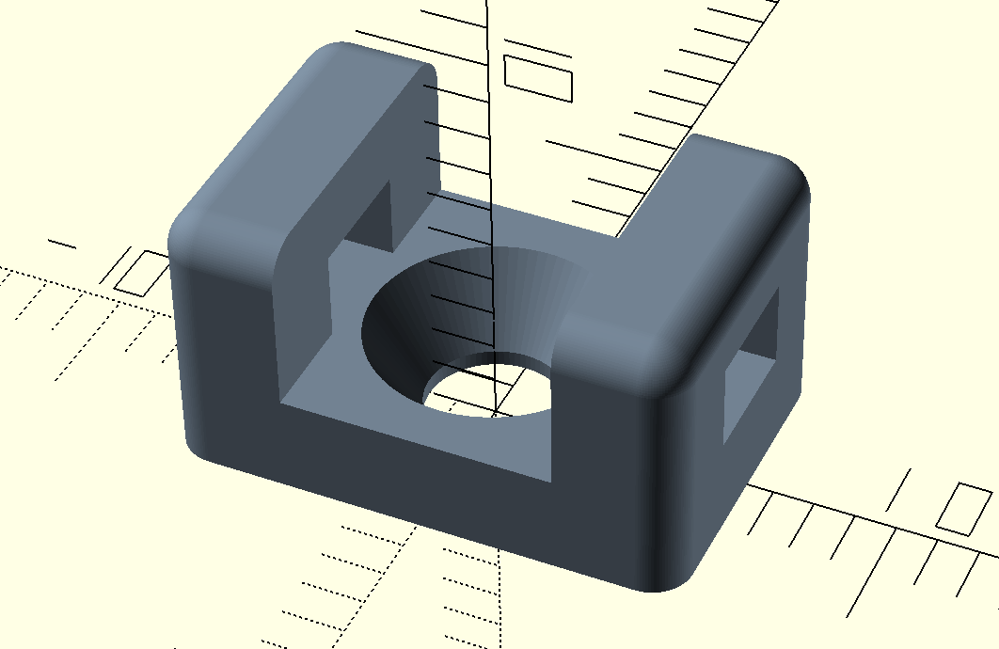
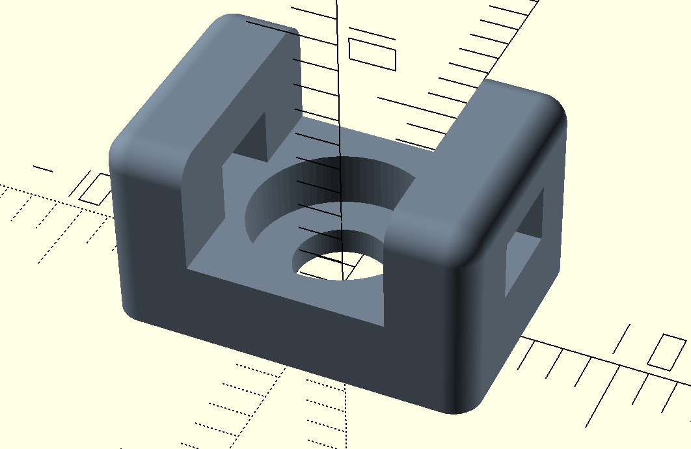
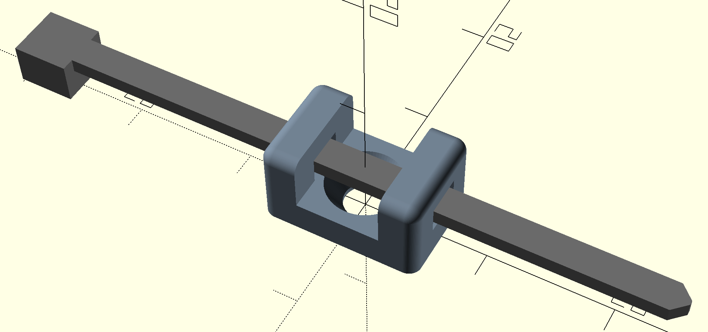
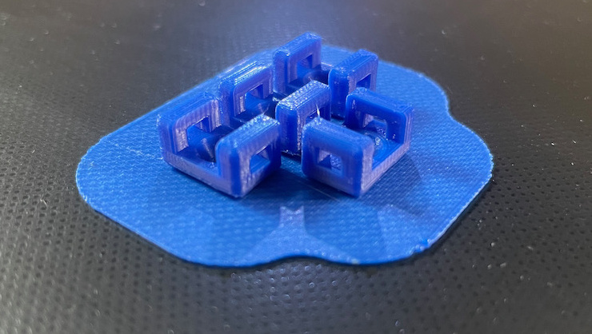

# Cable Tie Holders
OpenSCAD design file for a simple screw-down cable-tie holder to assist with cable management. The screw hole is designed for M3 flat-head or round (panel mount, cap/button or socket head) screw types and two cable-tie attachment openings will work with Nylon zip ties up to 3 mm wide x 2 mm thick, or other attachment mechanism(s) of choice that will work with this size opening.



The red, blue, and black holders above are printed in PLA; the dark gray is in PETG (WIP: I'm still fine-tuning my print settings for my this material, but they're functional). Shown for default configuration (flat head M3 screw).

The repository currently only provides the design for this single size holder, **cable_tie_holder_m3_3x2mm()**, with other sizes planned. Customization of this model should be fairly straightforward, by modifying the `screw_type` selection and dimensional variables near the top of the design file to suit your needs. Models for flat head and rounded head screw types (both countersunk) are shown here:

 

Using flat head screws provides the most compact model using default settings (12.7 x 8.5 x 6.7 mm). The round and cylindrical (socket head) types produce slightly larger models.

## Printing Information
The design file includes some utility modules which I used for visualization during the creation of the cable-tie holder. Specifically, there are **simple_zip_tie()** and **generic_screw_model()** modules. Display of these objects can be turned on/off using the variables near the top of the file (set to `true`/`false` accordingly):
```openscad
display_zip_tie = false;
display_screw = false;
```
For instance, setting `display_zip_tie = true;` would yield:



These are nice visualization tools, however they should be turned off (`false`) prior to rendering and exporting the model as STL for 3D printing.

The resulting 3D part is fairly small which can sometimes create problems with build-plate adhesion, depending on your setup. If you encounter this problem, I recommend printing multiple copies of the cable tie holder model using a 'raft':



## License
Creative Commons Attribution-NonCommercial-ShareAlike 4.0. Please see accompanying license.txt file for details.

